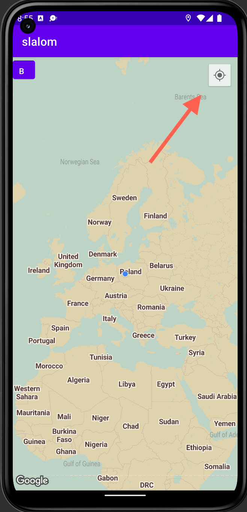

# Slalom app
 
Avoid Monsters!

# Setup
- Add GoogleMaps api key to loca.properties as ```MAPS_API_KEY```


# Gameplay

Monsters are nearby. You have to avoid them. Their `territory` looks like this.


But... You can fight with them. Old lady told you, that there is magic plant. You have to find `green` on the map.


## Leaderboard
```Home screen with leaderboard. You can see previous attempts.```


--- 

## Start game
```To start just pres START GAME.```


--- 

## Loading
```Wait blue dot that will appear on the map.```


--- 

## Zoom - FAST
```Zoom in by clicking find me button on the map.```


--- 

## Day
```Monsters can't hurt you during the day. Move fast.```


--- 

## Back
```If you are scared, you can always go back.```


--- 

## Night
```Avoid monsters at all times! They can eat you on their teritory.```


--- 

## You lost
```The world will never be the same :( Monsters won...```


--- 

## You won!
```Congrats! Day will never end. But I'm not sure if that's good either.```


